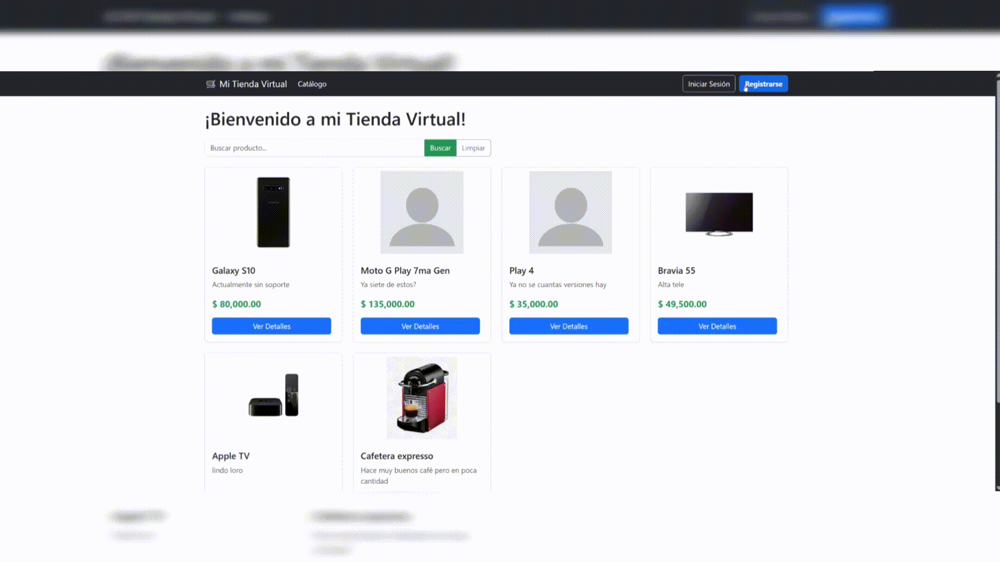

🛒 Tienda Virtual (TP Final - Nivel 3)
Proyecto Full-Stack desarrollado en C# (.NET Framework 4.8.1) y ASP.NET WebForms. Aplicación de catálogo de productos con autenticación, gestión de artículos (CRUD), sistema de favoritos asíncrono y perfil de usuario.

Desarrollado aplicando una Arquitectura en 3 Capas estricta y fuertes estándares de seguridad en el procesamiento de datos.

> 🌐 **Live Demo:** [http://tiendavirtual-lucianobasti.somee.com/](http://tiendavirtual-lucianobasti.somee.com/)

🔐 Accesos de Prueba
Para probar la funcionalidad completa del sistema sin necesidad de registrarse, utilizar las siguientes credenciales:

Administrador (Acceso total al CRUD): Usuario: admin | Clave: admin

Cliente (Catálogo y Favoritos): Usuario: test | Clave: test

Características y Logros Técnicos
Arquitectura en 3 Capas: Separación de responsabilidades en proyectos de Dominio, Negocio y Presentación.

Seguridad y Doble Validación (Front/Back): - Control de UX en tiempo real con JavaScript y Bootstrap (is-valid/is-invalid).

Barreras en el servidor (C#) para prevenir ingresos nulos, valores negativos y truncamiento de SQL.

Prevención de Códigos de Artículo (SKU) duplicados mediante consultas LINQ.

Manejo Avanzado de Estado: - Uso de ScriptManager para feedback asíncrono (Flash Messages) sin pérdida de datos en formularios.

Redirecciones seguras controlando el ciclo de vida de WebForms.

Sistema de Favoritos: Interfaz dinámica basada en la memoria de sesión del usuario.

🛠️ Stack Tecnológico
Back-End: C# 7.3, .NET Framework 4.8.1, ASP.NET WebForms.

Front-End: HTML5, CSS3, JavaScript, Bootstrap 5.

Base de Datos: SQL Server (ADO.NET puro, sin ORMs).

⚙️ Preparación y Puesta en Marcha
Clonar el repositorio: Descarga el código y abre la solución e-commerce.sln en Visual Studio.

Configurar la Base de Datos: - El proyecto incluye el archivo Script_Catalogo_DB.sql en la raíz.

Ejecuta este script en SQL Server Management Studio para crear la base de datos CATALOGO_WEB_DB y cargar los datos iniciales de prueba.

Configurar la Conexión: - La cadena de conexión se encuentra en el archivo Web.config (y puede ajustarse en la clase Negocio/AccesoDatos.cs).

Ejecutar: Compilar y lanzar el proyecto utilizando IIS Express (F5).

Sobre el Autor
Luciano Tito Cedrón Estudiante de la Tecnicatura Universitaria en Programación (UTN-FRGP) y desarrollador en formación constante. Actualmente orientando mi carrera hacia la Ingeniería de Datos en el ecosistema de Microsoft Azure.
