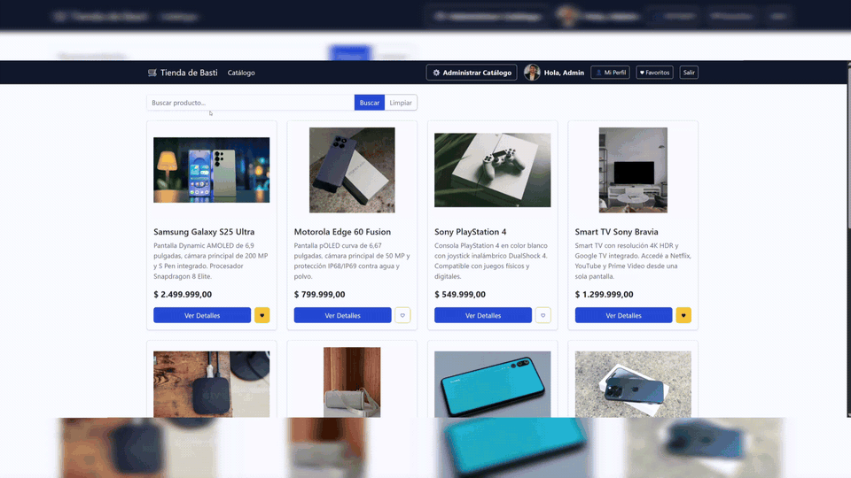

# 🛒 Tienda Virtual (TP Final - Nivel 3)

Proyecto Full-Stack desarrollado en **C# (.NET Framework 4.8.1)** y **ASP.NET WebForms**. Aplicación de catálogo de productos con autenticación, gestión de artículos (CRUD), sistema de favoritos asíncrono y perfil de usuario.

Desarrollado aplicando una **Arquitectura en 3 Capas** estricta y buenas prácticas de seguridad en el procesamiento de datos.

> 🌐 **Live Demo:** [http://tiendavirtual-lucianobasti.somee.com/](http://tiendavirtual-lucianobasti.somee.com/)

## 🔐 Accesos de Prueba

Para probar la aplicación sin necesidad de registrarse (el login es por email):

| Rol | Email | Contraseña |
|---|---|---|
| Cliente (catálogo, favoritos y perfil) | `test@test.com` | `test` |

El panel de administración (alta, modificación, baja y filtros de artículos) se puede ver en el GIF de arriba. Si querés probarlo en vivo, escribime por [LinkedIn](https://www.linkedin.com/in/luciano-facundo-tito-cedrón) y te paso un acceso de administrador.

## ✨ Características y Logros Técnicos

- **Arquitectura en 3 Capas:** separación de responsabilidades en proyectos de Dominio, Negocio y Presentación.
- **Seguridad y Doble Validación (Front/Back):**
  - Control de UX en tiempo real con JavaScript y Bootstrap (`is-valid` / `is-invalid`).
  - Barreras en el servidor (C#) para prevenir ingresos nulos, valores negativos y truncamiento de datos en SQL.
  - Consultas 100% parametrizadas para prevenir inyección SQL.
  - Credenciales de base de datos fuera del repositorio (`claves.config`).
- **Integridad de datos:** prevención de códigos de artículo (SKU) y emails duplicados, en la aplicación y con restricciones en la base de datos.
- **Manejo Avanzado de Estado:**
  - Uso de `ScriptManager` para feedback asíncrono (flash messages) sin pérdida de datos en formularios.
  - Redirecciones seguras controlando el ciclo de vida de WebForms.
- **Sistema de Favoritos:** interfaz dinámica basada en la sesión del usuario.

## 🛠️ Stack Tecnológico

- **Back-End:** C# 7.3, .NET Framework 4.8.1, ASP.NET WebForms.
- **Front-End:** HTML5, CSS3, JavaScript, Bootstrap 5.
- **Base de Datos:** SQL Server (ADO.NET puro, sin ORMs).
- **Deploy:** Somee (IIS + SQL Server).

## ⚙️ Preparación y Puesta en Marcha

1. **Clonar el repositorio** y abrir la solución `TpFinalNivel3TitoLuciano.slnx` en Visual Studio.
2. **Crear la base de datos:** en SQL Server Management Studio, crear una base vacía (`CREATE DATABASE CATALOGO_WEB_DB;`) y ejecutar sobre ella `Script_Catalogo_DB.sql` (en la raíz), que crea las tablas y carga los datos iniciales de prueba. En un hosting compartido, ejecutarlo directamente sobre la base que da el hosting.
3. **Configurar la conexión:**
   - En la carpeta `e-commerce`, copiar `claves.config.example` y renombrar la copia como `claves.config`.
   - Completar la cadena de conexión con los datos de tu servidor SQL.
   - `claves.config` está en `.gitignore`: nunca se sube al repositorio.
4. **Ejecutar:** compilar y lanzar el proyecto con IIS Express (F5).

## 👤 Sobre el Autor

**Luciano Facundo Tito Cedrón.** Estudiante de la Tecnicatura Universitaria en Programación (UTN-FRGP) y desarrollador en formación constante. Actualmente orientando mi carrera hacia la Ingeniería de Datos en el ecosistema de Microsoft Azure.